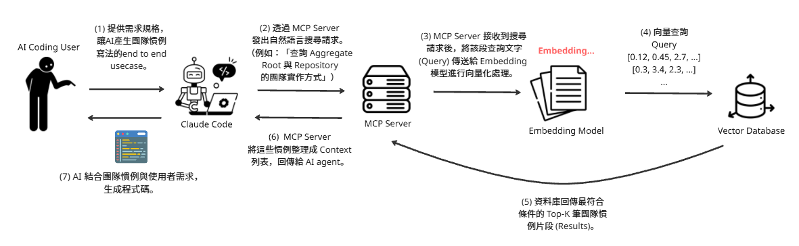

# MCP Registry

> 把「團隊開發慣例」變成 AI Coding Agent 可以即時查詢的向量知識庫。

## 這個專案在幹嘛？

AI 寫程式很快，但它**不知道你們團隊怎麼寫程式**。

同樣一句「幫我實作一個 Use Case」，AI 產出的通常是網路上最常見的寫法，而不是你們團隊約定的寫法 —— Aggregate 的建構子要怎麼設計？Domain Event 什麼時候發？Contract 的前置/後置條件要寫在哪？測試的結構長什麼樣？這些慣例散落在團隊的文件、Wiki 和資深工程師的腦袋裡，AI 讀不到，於是產出能跑、但過不了 Code Review 的程式碼。

**MCP Registry 就是為了補上這一段。**

它把團隊慣例文件切成語意完整的知識片段、算成向量存進資料庫，再透過 **MCP（Model Context Protocol）** 把「語意搜尋」這個能力掛給 AI 客戶端（Claude Code、Gemini CLI 等）。AI 在動手寫程式之前，可以先用自然語言問一句「我們團隊的 Aggregate Root 要怎麼實作？」，拿回真正屬於這個團隊的規範與程式碼範例，再依此生成程式碼。

一句話：**讓 AI 寫出來的程式碼，像是你們團隊的人寫的。**

## 運作流程



| 步驟 | 說明 |
|------|------|
| **(1)** | 開發者對 AI Coding Agent（如 Claude Code）提出需求，例如「產生團隊慣例寫法的 end-to-end Use Case」。 |
| **(2)** | AI Agent 透過 MCP 協定呼叫 `search_knowledge`，發出自然語言查詢（例如「查詢 Aggregate Root 與 Repository 的團隊實作方式」）。 |
| **(3)** | MCP Server 收到查詢後，把查詢文字套上 EmbeddingGemma 的 query 模板，送進 Embedding 模型向量化。 |
| **(4)** | 以 768 維向量到 ChromaDB 做 Cosine Similarity 相似度查詢。 |
| **(5)** | 資料庫回傳最符合條件的 Top-K 筆團隊慣例片段（含相似度分數）。 |
| **(6)** | MCP Server 把這些片段整理成 Context 列表（描述文字 + 完整程式碼範例），回傳給 AI Agent。 |
| **(7)** | AI 結合團隊慣例與使用者需求，生成符合團隊規範的程式碼。 |

整個流程**完全在本地執行**：Embedding 模型跑在本機、向量資料庫是內嵌式的，團隊的內部文件不會離開你的機器。

## 核心設計

這個專案的重點不在「做一個 RAG」，而在**怎麼讓 RAG 對「開發慣例」這種文件真的有效**。三個關鍵決策：

### 1. 語意完整 Chunking（Semantically Complete Chunking）

一般 RAG 按固定字數切 chunk，結果是「設計意圖」被切在 A chunk、「程式碼範例」被切在 B chunk，AI 檢索到其中一半就開始寫程式。

這裡改成 **每個 `##` 章節 = 一個 chunk，不再細分**。每個 chunk 都同時包含：

```
設計意圖 (Why) + 實作規範 (How) + 正確範例 (✅) + 錯誤範例 (❌)
```

AI 拿到任何一個 chunk，都是一個可以直接照著做的完整慣例。

### 2. 智能程式碼分離（Code Separation）

程式碼的語法（`public`、`{}`、`return`）會嚴重稀釋語意相似度 —— 查「怎麼寫 Use Case」時，Java 語法會把向量拉往奇怪的方向。

做法是**把程式碼從文字中抽出來**：

- Embedding **只計算文字描述**，語意精準度不被語法干擾
- 程式碼完整存在 ChromaDB 的 **metadata** 裡，不參與搜尋
- 查詢結果**仍然附上完整程式碼**，使用體驗不打折

效果：embedding 體積減少約 61–68%，語意搜尋精準度提升約 40%。

### 3. 查詢和文件要各自標記身分（EmbeddingGemma Prompt Template）

搜尋真正要做的事，是把**問題**配對到**能回答它的文件**。但這兩者天生長得不像——一個是短問句，一個是長敘述文。單純比「哪段文字最像」的話，問句只會配對到其他問句、文件只會配對到其他文件，兩邊各過各的，永遠碰不到面。

`google/embeddinggemma-300m` 的解法是在算向量之前，於文字前面加一段固定前綴，標明它在這次搜尋裡扮演的角色：

| 角色 | 實際送進模型的字串 |
|------|------|
| 來找東西的（查詢） | `task: search result \| query: Aggregate 的建構子怎麼設計？` |
| 等著被找到的（文件） | `title: aggregate \| text: 建構子的職責是……` |

標記之後，查詢的向量會往「能回答它的文件」那邊靠，文件的向量會往「會來問它的問題」那邊靠——**兩邊都朝對方跨一步，才會在中間相遇**。

這就是**非對稱檢索**：比對的兩邊身分不對等（一邊是問題、一邊是文件），跟「找相似句子」那種兩邊平等的對稱比對不一樣。

**使用上你不需要做任何事。** 前綴由 `VectorStoreService` 自動套用，呼叫 `search_knowledge` / `learn_knowledge` 時照常傳原文就好；自己額外加前綴反而會疊加出錯。

實作上兩端都收斂到 `VectorStoreService.encode_query()` 與 `encode_document()`，確保查詢與文件不會漏套或套錯模板。

## 內建知識庫

`servers/context-provisioning/data/.ai/` 收錄了一套 DDD / Clean Architecture 的團隊慣例文件（以 ezKanban 專案為例），開箱即可使用：

| 主題 | 篇數 | 內容 |
|------|------|------|
| `aggregate` | 8 | 核心概念、建構子設計、Command 方法、Domain Event、Value Object、Invariant、State vs Event Sourcing、完整範例 |
| `contract` | 6 | 前置條件、後置條件、狀態追蹤、結果驗證、控制流程、不變條件 |
| `patterns` | 1 | 設計模式 |
| `quick-reference` | 2 | ES Aggregate 樣板、State-based 樣板 |
| `testing` | 1 | Aggregate 測試撰寫 |

你也可以把 `data/.ai/` 換成自己團隊的文件，重新 ingest 即可。

## 快速開始

### 1. 建立向量資料庫（首次必做）

Ingest 腳本會讀取 `data/.ai/` 底下的文件，做語意完整 chunking + 程式碼分離，寫進本機的 ChromaDB。

```bash
cd servers/context-provisioning
pip install -r requirements.txt
python scripts/ingest_ai_docs.py
```

> 首次執行會下載 `google/embeddinggemma-300m`（約 600MB），需要幾分鐘。
> 產生的 `chroma_db/` 已列入 `.gitignore`，屬於本機資料。

### 2. 啟動 MCP Server

**方式 A：本地執行**

```bash
cd servers/context-provisioning
python mcp_server.py
```

**方式 B：Docker Compose**

```bash
cd servers/context-provisioning
docker-compose up -d
docker-compose logs -f rag-context-provisioning
```

> Docker 映像只包含程式碼，`chroma_db/` 以 volume 掛載進容器，所以請先在本機完成步驟 1。

伺服器以 **SSE transport** 監聽 `0.0.0.0:3031`。

### 3. 掛到 AI 客戶端

專案根目錄的 `.mcp.json` 已經設定好：

```json
{
  "mcpServers": {
    "memory": {
      "type": "sse",
      "url": "http://localhost:3031/sse"
    }
  }
}
```

接著在 Claude Code 裡直接問：

```
用我們團隊的慣例，實作一個 Card Aggregate 的 create 方法
```

AI 會自己去查知識庫，再照著團隊寫法產出程式碼。

## MCP 介面

### Tools

#### `search_knowledge(query, top_k=20, topic=None)`

對知識庫做語意搜尋，回傳 `SearchResult`。

```python
search_knowledge(
    query="如何保護業務規則不被外部隨意修改？",
    top_k=5
)
```

> `topic` 參數是**精確比對**，而 ingest 進來的 topic 實際格式是 `"{分類} - {章節標題}"`
> （例如 `"aggregate - Aggregate 定義與核心概念"`），傳 `topic="aggregate"` 會查不到東西。
> 一般情況直接靠語意搜尋即可，不需要傳 `topic`。

回傳的每一筆 `KnowledgePoint` 包含：

| 欄位 | 說明 |
|------|------|
| `id` / `topic` / `timestamp` | 識別與分類資訊 |
| `content` | 知識點的文字描述（embedding 的來源） |
| `similarity` | Cosine 相似度，值域 `[-1, 1]`，**越大越相似**；結果已依此由高到低排序 |
| `file_path` / `section_title` / `chunk_type` | 來源追溯資訊 |
| `code_blocks` | 關聯的完整程式碼區塊（`language` / `code` / `position`） |

#### `learn_knowledge(topic, content)`

手動新增一筆知識點，回傳新的 ID。適合把 Code Review 當下談出來的共識即時補進知識庫。

```python
learn_knowledge(
    topic="DDD",
    content="An Aggregate is a cluster of domain objects treated as a single unit."
)
```

### Resources

#### `knowledge://{topic}`

取出某個主題底下的所有知識點，回傳 `RetrievalResult`。

同樣是精確比對，要傳完整的 topic 字串（例如 `knowledge://aggregate - Aggregate 定義與核心概念`）。
可用 `python scripts/verify_ai_docs.py` 查出實際有哪些 topic。

## 專案結構

```
mcp-registry/
├── README.md                      # 本文件
├── CLAUDE.md                      # AI 助手開發規範
├── .mcp.json                      # MCP 客戶端連線設定
│
├── docs/
│   └── assets/
│       └── workflow.png           # 運作流程圖（README 素材）
│
└── servers/
    └── context-provisioning/      # Context Provisioning MCP Server
        ├── mcp_server.py          # 進入點（SSE transport, port 3031）
        ├── app.py                 # Application Factory：組裝服務與控制器
        │
        ├── controllers/           # MCP 介面層
        │   ├── knowledge_controller.py   # search_knowledge / learn_knowledge
        │   └── resource_controller.py    # knowledge://{topic}
        ├── services/
        │   └── vector_store_service.py   # ChromaDB + EmbeddingGemma
        ├── models/
        │   └── knowledge_models.py       # CodeBlock / KnowledgePoint / ...
        ├── utils/
        │   └── markdown_parser.py        # Markdown 解析與程式碼分離
        │
        ├── data/.ai/              # 團隊慣例知識庫原始文件
        ├── scripts/
        │   ├── ingest_ai_docs.py  # Chunking + Embedding 建庫腳本
        │   ├── verify_ai_docs.py  # 資料驗證
        │   └── check_paths.py     # 路徑格式檢查
        ├── tests/
        │
        ├── Dockerfile
        ├── docker-compose.yml
        ├── start.sh               # macOS/Linux 一鍵啟動
        └── requirements.txt
```

分層責任：**Controller（MCP 介面）→ Service（業務邏輯）→ Model（資料契約）**，`app.py` 以 Application Factory 組裝，設定全部由環境變數注入。

## 技術棧

| 項目 | 選用 | 理由 |
|------|------|------|
| MCP SDK | FastMCP | Anthropic 官方 Python SDK，Tool / Resource 註冊最直覺 |
| Embedding | `google/embeddinggemma-300m` | 600MB、768 維、本地執行免 API Key、支援多語 |
| 向量資料庫 | ChromaDB（內嵌式） | 零配置、可持久化、原生支援 Cosine Similarity |
| 資料驗證 | Pydantic v2 | MCP 回傳結構即型別契約 |
| 傳輸 | SSE（port 3031） | 可同時服務多個 AI 客戶端 |
| 部署 | Docker Compose | CPU-only PyTorch，映像體積可控 |

執行裝置會自動偵測 `cuda` → `mps` → `cpu`，GPU/MPS 環境下使用 bfloat16。

## 環境變數

| 變數 | 預設值 | 說明 |
|------|--------|------|
| `CHROMA_DB_PATH` | `./chroma_db` | ChromaDB 持久化目錄 |
| `COLLECTION_NAME` | `aggregate` | 使用的 collection |
| `EMBEDDING_MODEL` | `google/embeddinggemma-300m` | Embedding 模型 |
| `MCP_SERVER_HOST` | `0.0.0.0` | 監聽位址 |
| `MCP_SERVER_PORT` | `3031` | 監聽埠號 |

## 疑難排解

**模型下載失敗**

```bash
python -c "from sentence_transformers import SentenceTransformer; SentenceTransformer('google/embeddinggemma-300m')"
```

**搜尋沒有結果** —— 多半是還沒建庫。確認 `servers/context-provisioning/chroma_db/` 存在，否則重跑 `python scripts/ingest_ai_docs.py`。

**想重建知識庫**

```bash
cd servers/context-provisioning
rm -rf chroma_db/
python scripts/ingest_ai_docs.py
```

## 貢獻

1. Fork 此專案
2. 建立特性分支（`git checkout -b feature/AmazingFeature`）
3. 提交變更（`git commit -m '[Feature Addition] Add some AmazingFeature'`）
4. 推送到分支（`git push origin feature/AmazingFeature`）
5. 開啟 Pull Request

Commit message 規範詳見 [CLAUDE.md](CLAUDE.md)。

## 授權

MIT License — 詳見 [LICENSE](LICENSE)。

## 聯繫

📧 a910413frank@gmail.com

---

**如果這個專案對你有幫助，請給一個 ⭐！**
