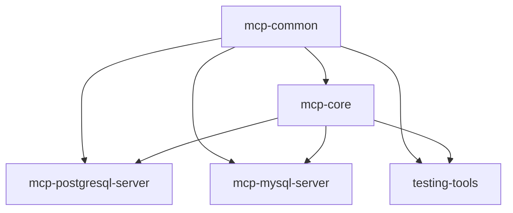

# MCP Registry Java 專案總覽

## 🎯 專案架構

MCP Registry Java 是基於現代 Java 技術棧的企業級 MCP Server 實現，採用 Maven 多模組設計，提供 PostgreSQL 和 MySQL 資料庫的完整 MCP 協議支援。

## 📁 專案模組結構

### 🔧 mcp-common
**共用核心模組** - 所有其他模組的基礎依賴

**職責**：
- 定義共用的資料模型 (DTOs, Entities)
- 提供公用的例外處理類別
- 實現安全驗證機制
- 提供工具類和常數定義

**主要組件**：
```java
com.mcp.common/
├── model/              # 共用資料模型
│   ├── ConnectionInfo.java
│   ├── QueryRequest.java
│   ├── QueryResult.java
│   └── TableSchema.java
├── exception/          # 例外類別
│   ├── McpException.java
│   ├── ConnectionException.java
│   └── QueryExecutionException.java
├── validator/          # 安全驗證
│   ├── SqlSafetyValidator.java
│   └── ConnectionValidator.java
└── util/               # 工具類
    ├── SqlUtil.java
    └── SecurityUtil.java
```

### 🏗️ mcp-core
**MCP 協議核心實現** - MCP 通訊協議和抽象層

**職責**：
- 實現 MCP 協議的核心通訊邏輯
- 提供抽象的 MCP 工具基礎類別
- 定義標準化的 MCP 介面契約
- 處理 MCP 訊息序列化/反序列化

**主要組件**：
```java
com.mcp.core/
├── protocol/           # MCP 協議實現
│   ├── McpProtocolHandler.java
│   ├── McpMessageProcessor.java
│   └── McpToolRegistry.java
├── tool/               # 工具抽象層
│   ├── AbstractMcpTool.java
│   ├── DatabaseTool.java
│   └── ToolExecutionContext.java
└── service/            # 核心服務
    ├── McpServerService.java
    └── ToolDiscoveryService.java
```

### 🐘 mcp-postgresql-server
**PostgreSQL MCP Server** - PostgreSQL 專用的 MCP 工具實現

**職責**：
- 提供完整的 PostgreSQL 資料庫操作工具
- 實現 PostgreSQL 特定的優化和功能
- 支援 R2DBC 反應式資料庫連線
- 提供企業級的連線池管理

**核心工具**：
- **連線管理工具**：`add_connection`, `test_connection`, `list_connections`
- **查詢執行工具**：`execute_query`, `execute_transaction`, `execute_batch`
- **Schema 管理工具**：`get_table_schema`, `list_tables`, `explain_query`

**主要組件**：
```java
com.mcp.postgresql/
├── controller/         # MCP 工具控制器
│   ├── PostgreSqlMcpController.java
│   ├── ConnectionController.java
│   ├── QueryController.java
│   └── SchemaController.java
├── service/            # 業務邏輯服務
│   ├── DatabaseConnectionService.java
│   ├── DatabaseQueryService.java
│   └── DatabaseSchemaService.java
├── config/             # PostgreSQL 配置
│   ├── PostgreSqlConfig.java
│   ├── R2dbcConfig.java
│   └── CleanArchitectureConfig.java
└── tool/               # 具體工具實現
    ├── ConnectionManagementTool.java
    ├── QueryExecutionTool.java
    └── SchemaManagementTool.java
```

### 🐬 mcp-mysql-server
**MySQL MCP Server** - MySQL 專用的 MCP 工具實現

**職責**：
- 提供完整的 MySQL 資料庫操作工具
- 實現 MySQL 特定的語法和功能支援
- 支援 R2DBC MySQL 驅動
- 針對 MySQL 優化的查詢執行

**核心特性**：
- MySQL 8.0+ 完整支援
- MySQL 特有語法支援 (如 `SHOW` 命令系列)
- JSON 欄位操作工具
- MySQL 特定的索引和性能分析

**主要組件**：
```java
com.mcp.mysql/
├── controller/         # MCP 工具控制器
│   ├── MySqlMcpController.java
│   ├── MySqlConnectionController.java
│   ├── MySqlQueryController.java
│   └── MySqlSchemaController.java
├── service/            # 業務邏輯服務
│   ├── MySqlConnectionService.java
│   ├── MySqlQueryService.java
│   └── MySqlSchemaService.java
├── config/             # MySQL 配置
│   ├── MySqlConfig.java
│   ├── MySqlR2dbcConfig.java
│   └── MySqlSecurityConfig.java
└── tool/               # MySQL 專用工具
    ├── MySqlConnectionTool.java
    ├── MySqlQueryTool.java
    └── MySqlSchemaTool.java
```

### 🧪 testing-tools
**測試工具模組** - 開發和測試專用工具

**職責**：
- 提供互動式測試工具
- 實現自動化整合測試
- 提供 MCP Server 效能測試
- 支援 TestContainers 容器化測試

**測試類型**：
- **單元測試**：每個工具的獨立測試
- **整合測試**：完整的 MCP 協議測試
- **效能測試**：查詢效能和連線池測試
- **BDD 測試**：使用 ezSpec 框架的行為驅動測試

**主要組件**：
```java
com.mcp.testing/
├── interactive/        # 互動式測試工具
│   ├── TestingApplication.java
│   ├── InteractiveTestController.java
│   └── TestExecutionService.java
├── integration/        # 整合測試
│   ├── PostgreSqlIntegrationTest.java
│   ├── MySqlIntegrationTest.java
│   └── TestContainersConfig.java
└── performance/        # 效能測試
    ├── QueryPerformanceTest.java
    └── ConnectionPoolTest.java
```

## 🔄 模組間依賴關係



## 🚀 技術特色

### 企業級特性
- **Spring Boot 3.x**：最新的企業級 Java 框架
- **R2DBC**：反應式資料庫連線，提供更好的並發性能
- **Project Reactor**：完整的反應式程式設計支援
- **Clean Architecture**：清晰的分層架構設計

### 安全性保障
- **參數化查詢**：防止 SQL Injection 攻擊
- **權限控制**：細粒度的操作權限管理
- **安全驗證**：多層次的輸入驗證機制
- **審計日誌**：完整的操作記錄追蹤

### 效能優化
- **連線池管理**：HikariCP 高效能連線池
- **查詢優化**：智能查詢快取和批次操作
- **資源管理**：自動資源清理和記憶體優化
- **並發處理**：反應式程式設計提供更好的並發能力

### 監控與可觀測性
- **Spring Boot Actuator**：完整的健康檢查和監控端點
- **Micrometer**：標準化的指標收集
- **結構化日誌**：使用 MDC 進行上下文日誌記錄
- **分散式追蹤**：支援 Spring Cloud Sleuth

## 🎯 使用場景

### PostgreSQL MCP Server 適用於
- 企業級資料倉儲管理
- 複雜的關聯式資料查詢
- 高併發的資料分析任務
- 需要 ACID 特性的交易系統

### MySQL MCP Server 適用於
- Web 應用程式後端資料庫
- 高讀取負載的應用場景
- 需要快速原型開發的專案
- JSON 資料處理和分析

### 整合使用場景
- **資料遷移**：從 MySQL 遷移到 PostgreSQL
- **多資料庫環境**：同時管理多種資料庫系統
- **資料同步**：在不同資料庫間進行資料同步
- **智能分析**：讓 LLM 在多種資料庫間進行智能分析

## 📊 效能指標

### 連線管理
- 預設連線池大小：10 個連線
- 最大連線池大小：50 個連線
- 連線超時：30 秒
- 空閒連線回收：5 分鐘

### 查詢執行
- 預設查詢超時：30 秒
- 最大查詢長度：50,000 字元
- 批次操作上限：1,000 筆記錄
- 查詢結果快取：5 分鐘

### 記憶體使用
- JVM 預設記憶體：512MB - 1GB
- 連線池記憶體：~50MB per pool
- 查詢快取記憶體：最大 100MB
- 總記憶體建議：最少 2GB

## 🔧 部署建議

### 開發環境
```bash
# 使用 Maven 直接執行
mvn spring-boot:run -pl mcp-postgresql-server
mvn spring-boot:run -pl mcp-mysql-server
```

### 測試環境
```bash
# 使用 Docker Compose
docker-compose up -d
```

### 生產環境
```bash
# 使用 Kubernetes
kubectl apply -f deployment/k8s/
```

## 📚 相關文檔

- [快速開始指南](guides/QUICK_START.md)
- [API 參考文檔](MCP_SERVERS_USAGE.md)
- [系統架構說明](ARCHITECTURE.md)
- [Java 遷移計畫](project/JAVA_MIGRATION_PLAN.md)
- [部署指南](DOCKER_HUB_GUIDE.md)

---

**總結**：MCP Registry Java 提供了一個完整、企業級的 MCP Server 解決方案，透過模組化設計和現代 Java 技術棧，為 LLM 提供強大且安全的資料庫操作能力。每個模組都有明確的職責分工，既可以獨立使用，也可以組合使用以滿足複雜的企業需求。