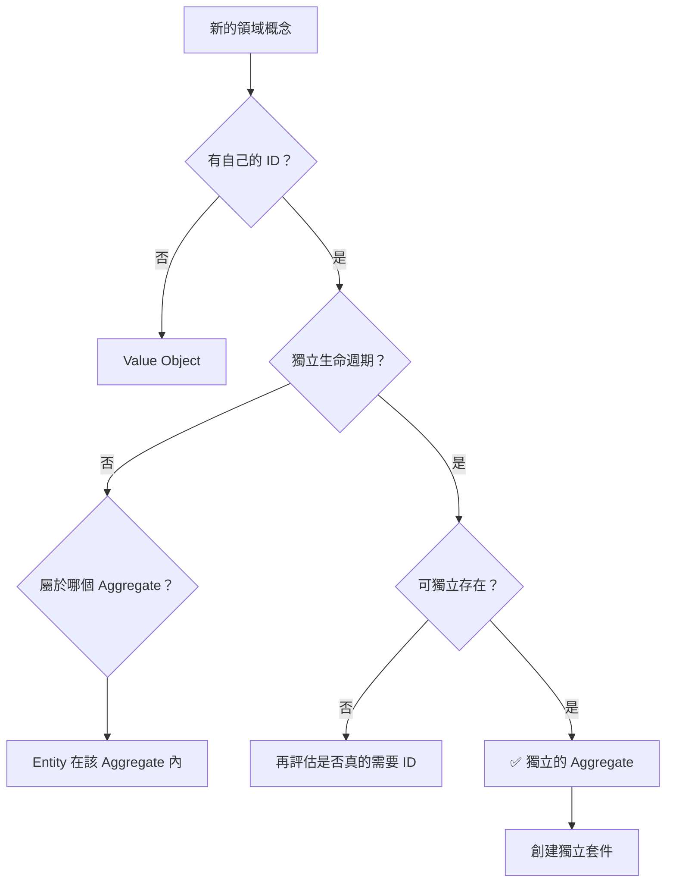

# Aggregate 識別檢查清單

> 在實作任何新的領域概念前，使用此檢查清單判斷它是否應該是獨立的 Aggregate。

## 🎯 核心判斷標準

### 1. 獨立性檢查
- [ ] **生命週期獨立**：這個概念有自己的創建、修改、刪除流程嗎？
- [ ] **身份獨立**：它有自己的唯一識別碼（ID）嗎？
- [ ] **存在獨立**：它可以在其他 Aggregate 不存在時獨立存在嗎？

### 2. 交易邊界檢查
- [ ] **一致性邊界**：它有需要原子性保護的不變條件嗎？
- [ ] **並發控制**：多個使用者可能同時修改它嗎？
- [ ] **交易範圍**：修改它時，需要同時修改其他 Aggregate 嗎？（如果是，可能設計有誤）

### 3. 業務概念檢查
- [ ] **領域專家認同**：領域專家是否將它視為獨立概念？
- [ ] **業務規則**：它有自己獨特的業務規則嗎？
- [ ] **狀態管理**：它有自己的狀態轉換邏輯嗎？

## 🚦 決策流程



## 📦 套件組織決策

### 如果是獨立 Aggregate：
```
src/main/java/[rootPackage]/[aggregate-name]/
├── entity/
│   ├── [AggregateName].java
│   ├── [AggregateName]Events.java
│   └── [相關的 Value Objects].java
├── usecase/
│   ├── port/
│   │   ├── in/
│   │   └── out/
│   └── service/
```

### 如果是 Entity（在 Aggregate 內）：
- 放在所屬 Aggregate 的 `entity` 套件內
- 不需要獨立的套件結構

## 🔴 常見錯誤警示

### ❌ 錯誤模式
1. **關聯誤認為組合**
   - 錯誤：`ProductBacklogItem` 放在 `product.entity` 下
   - 原因：兩者只是關聯關係，不是組合關係

2. **過度巢狀**
   - 錯誤：`product.backlog.item.entity`
   - 正確：`pbi.entity`（獨立套件）

3. **ID 引用誤認為包含**
   - 錯誤：因為有 `ProductId` 就放在 `product` 下
   - 正確：ID 引用不代表從屬關係

### ✅ 正確範例

| 概念 | 判斷 | 套件位置 | 理由 |
|-----|------|---------|------|
| Product | Aggregate | `product.entity` | 有 ProductId，獨立生命週期 |
| ProductBacklogItem | Aggregate | `pbi.entity` | 有 PbiId，可獨立於 Product 存在 |
| ProductGoal | Entity | `product.entity` | 屬於 Product，無獨立生命週期 |
| Task | Entity | `pbi.entity` | 屬於 PBI，無獨立生命週期 |
| Sprint | Aggregate | `sprint.entity` | 有 SprintId，獨立生命週期 |
| TagRef | Value Object | `pbi.entity` | 無 ID，不可變，描述關聯 |

## 🎓 實際案例分析

### Case 1: ProductBacklogItem
- ✅ 有自己的 ID：`PbiId`
- ✅ 獨立生命週期：創建、估算、選入 Sprint、完成
- ✅ 可獨立存在：Product 刪除後，PBI 可能還需要保留歷史記錄
- **結論**：獨立的 Aggregate → `pbi` 套件

### Case 2: ProductGoal
- ✅ 有概念上的識別：goal 的名稱或 ID
- ❌ 無獨立生命週期：隨 Product 創建和刪除
- ❌ 不可獨立存在：必須依附於 Product
- **結論**：Product 的 Entity → `product.entity` 套件

### Case 3: Task
- ✅ 有自己的 ID：`TaskId`
- ❌ 無獨立生命週期：隨 PBI 管理
- ❌ 不可獨立存在：必須屬於某個 PBI
- **結論**：PBI 的 Entity → `pbi.entity` 套件

## 📋 使用時機

1. **設計新功能時**：先用此檢查清單評估
2. **Code Review 時**：檢查套件組織是否合理
3. **重構時**：識別錯誤的 Aggregate 邊界
4. **討論時**：作為團隊共識的基礎

## 🔄 持續改進

此檢查清單應根據實際經驗持續更新：
- 發現新的判斷標準時，加入清單
- 遇到邊界案例時，記錄決策理由
- 團隊達成新共識時，更新指引