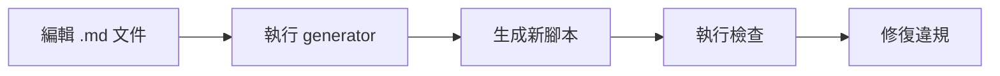

# Markdown-Based Script Generation Guide

## 📋 概述

本系統直接從 Coding Standards Markdown 文件生成檢查腳本，實現真正的 **Single Source of Truth**。

## 🎯 核心理念

**文件即規範，規範即檢查**
- Markdown 文件是唯一的規則來源
- 檢查腳本自動從文件生成
- 無需維護額外的規則檔案
- 文件更新即規則更新

## 🏗️ 系統架構

```
.ai/tech-stacks/java-ca-ezddd-spring/
└── coding-standards/              # Markdown 規範文件（唯一來源）
    ├── repository-standards.md
    ├── mapper-standards.md
    ├── aggregate-standards.md
    └── ...

.ai/scripts/
├── generate-check-scripts-from-md.sh  # 生成器
├── parse-md-rules.py                  # MD 解析器（自動生成）
└── generated/                          # 生成的檢查腳本
    ├── check-repository.sh
    ├── check-mapper.sh
    └── ...
```

## 📝 Markdown 規範格式

### 讓解析器識別規則的關鍵標記

#### 1. 錯誤模式（應該避免的）
```markdown
// ❌ 錯誤：不要創建自定義的 Repository interface
public interface ProductRepository extends Repository<Product, ProductId> {
    // 這會被檢查為違規
}
```

#### 2. 正確模式（應該遵循的）
```markdown
// ✅ 正確：直接使用 generic Repository
private final Repository<Product, ProductId> repository;
```

#### 3. 關鍵詞觸發
- **禁止模式**: `不要`、`禁止`、`don't`、`must not`
- **必須模式**: `必須`、`must`、`should`、`required`

### 最佳實踐：結構化的規則描述

```markdown
## 🔴 必須遵守的規則 (MUST FOLLOW)

### 1. Repository Interface 設計

**規則**：禁止創建自定義 Repository 介面

```java
// ❌ 錯誤：不要創建自定義的 Repository interface
public interface ProductRepository extends Repository<Product, ProductId> {
    List<Product> findByState(State state);  // 違規
}

// ✅ 正確：直接使用 generic Repository
@Service
public class CreateProductService {
    private final Repository<Product, ProductId> repository;
}
```

**重要原則**：
- 所有 Aggregate 都使用 generic Repository interface
- 不需要另外宣告特定的 Repository interface
```

## 🚀 使用方式

### 1. 生成檢查腳本

```bash
# 從所有 markdown 文件生成檢查腳本
./generate-check-scripts-from-md.sh

# 預覽模式（不實際生成）
./generate-check-scripts-from-md.sh --dry-run
```

### 2. 執行檢查

```bash
# 執行單一檢查
./generated/check-repository.sh

# 執行所有檢查
for script in ./generated/*.sh; do
    $script || exit 1
done

# 或使用 code-review.sh（智能選擇相關檢查）
./code-review.sh
```

### 3. 更新流程



## 🔍 解析器工作原理

### 1. 掃描 Markdown 文件
- 尋找 `## 🔴 必須遵守的規則` 區塊
- 識別 `// ❌ 錯誤` 和 `// ✅ 正確` 標記
- 提取程式碼區塊中的模式

### 2. 模式提取
```python
# 錯誤模式 → 生成 "should NOT exist" 檢查
if '❌' in marker:
    pattern = extract_pattern(code)
    generate_forbidden_check(pattern)

# 正確模式 → 生成 "should exist" 檢查  
if '✅' in marker:
    pattern = extract_pattern(code)
    generate_required_check(pattern)
```

### 3. 生成 Shell 檢查
```bash
# 檢查違規模式
VIOLATIONS=$(find "$SRC_DIR" -name "*.java" \
    -exec grep -l "interface.*Repository.*extends" {} \;)

if [ -n "$VIOLATIONS" ]; then
    echo "✗ Found violations"
    HAS_VIOLATIONS=true
fi
```

## 📊 已支援的檢查類型

| 文件 | 提取的規則 | 檢查內容 |
|-----|-----------|---------|
| repository-standards.md | 2 rules | • 禁止自定義 Repository 介面<br>• 禁止自定義查詢方法 |
| mapper-standards.md | 解析中 | • Mapper 必須在 usecase.port<br>• 必須使用靜態方法 |
| aggregate-standards.md | 解析中 | • 必須有 ensure 檢查<br>• Domain Event 必須有 metadata |
| controller-standards.md | 解析中 | • 正確的 HTTP 狀態碼<br>• 使用 @Valid 驗證 |

## 🔧 改進 Markdown 以提升解析準確度

### 方法 1：增加機器可讀註解
```markdown
<!-- CHECK: forbidden-pattern: interface.*Repository.*extends -->
// ❌ 錯誤：不要創建自定義的 Repository interface
```

### 方法 2：結構化規則區塊
```markdown
### 規則：禁止自定義 Repository 介面
- **類型**: forbidden
- **模式**: `interface.*Repository.*extends.*Repository`
- **檔案**: `*.java`
- **嚴重性**: ERROR
```

### 方法 3：明確的範例標記
```markdown
#### ❌ 違規範例
```java
// 這個程式碼應該被檢查為違規
interface ProductRepository extends Repository<Product, ProductId> {
}
```

#### ✅ 正確範例
```java
// 這個程式碼是正確的做法
private final Repository<Product, ProductId> repository;
```
```

## 🎯 最佳實踐

1. **保持 Markdown 格式一致**
   - 統一使用 `// ❌ 錯誤` 和 `// ✅ 正確`
   - 程式碼區塊使用 ` ```java ` 標記

2. **清晰的規則描述**
   - 每個規則有明確的標題
   - 包含具體的程式碼範例

3. **定期重新生成**
   ```bash
   # 可加入 Git hooks
   ./generate-check-scripts-from-md.sh
   git add generated/*.sh
   ```

4. **CI/CD 整合**
   ```yaml
   - name: Generate Check Scripts
     run: ./generate-check-scripts-from-md.sh
   
   - name: Run Checks
     run: ./code-review.sh
   ```

## 💡 優點

1. **零重複維護** - 只需維護 .md 文件
2. **永遠同步** - 文件即規範，規範即檢查
3. **自然書寫** - 寫文件時自然包含了規則
4. **完全透明** - 看文件就知道會檢查什麼
5. **版本控制** - 文件變更即規則變更，完整追蹤

## 🚦 故障排除

### 問題：解析器沒有提取到規則
**解決**：
1. 確認使用了正確的標記（`❌`、`✅`）
2. 確認程式碼在 ` ```java ` 區塊中
3. 檢查是否有關鍵詞（`不要`、`必須`）

### 問題：生成的檢查不準確
**解決**：
1. 改進 Markdown 格式，使用更明確的標記
2. 調整解析器規則（編輯 parse-md-rules.py）
3. 考慮加入機器可讀註解

## 📚 相關文件

- [Coding Standards 主文件](../tech-stacks/java-ca-ezddd-spring/coding-standards.md)
- [Repository Standards](../tech-stacks/java-ca-ezddd-spring/coding-standards/repository-standards.md)
- [Mapper Standards](../tech-stacks/java-ca-ezddd-spring/coding-standards/mapper-standards.md)

## 🎉 結論

使用 Markdown 作為 Single Source of Truth，我們實現了：
- **文件驅動的品質檢查**
- **自動化但人性化**
- **可維護且可擴展**

現在，寫文件就是寫規則，規則自動變成檢查！