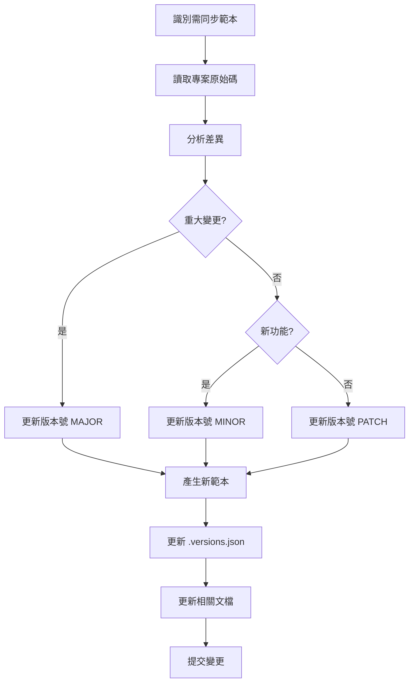

# 範本同步規範指南

## 📋 目錄
1. [概述](#概述)
2. [範本分類架構](#範本分類架構)
3. [同步原則](#同步原則)
4. [版本控制機制](#版本控制機制)
5. [同步流程](#同步流程)
6. [檢查清單](#檢查清單)
7. [自動化工具](#自動化工具)

## 概述

本指南定義了 AI 編碼範本與專案程式碼之間的同步規範，確保範本能準確反映專案的最新設計模式和最佳實踐。

## 範本分類架構

### 1. 三層範本結構
```
examples/
├── core/               # 核心模式（穩定，不常變動）
│   ├── aggregate/      # DDD 聚合根基礎模式
│   ├── value-object/   # 值物件基礎模式
│   └── repository/     # Repository 基礎模式
│
├── patterns/           # 設計模式（定期同步）
│   ├── usecase/        # Use Case 模式
│   ├── projection/     # Projection 查詢模式
│   ├── mapper/         # Mapper 轉換模式
│   └── controller/     # Controller REST API 模式
│
└── advanced/           # 進階模式（頻繁更新）
    ├── contract/       # 契約設計模式
    ├── reactor/        # 事件反應器模式
    └── optimization/   # 效能優化模式
```

### 2. 分類原則

| 分類 | 更新頻率 | 同步策略 | 範例 |
|-----|---------|---------|-----|
| core | 季度檢查 | 手動審核 | Aggregate, Repository |
| patterns | 月度同步 | 半自動化 | UseCase, Projection |
| advanced | 雙週同步 | 自動化檢查 | Contract, Reactor |

## 同步原則

### 1. 範本來源追蹤
每個範本檔案必須包含來源標記：

```java
/**
 * Template Version: 1.2.0
 * Based On: ai-todo-list/src/main/java/tw/teddysoft/aiplan/plan/entity/Plan.java
 * Last Sync: 2025-08-05
 * Pattern Category: core/aggregate
 * 
 * @deprecated 2.0.0 - Use Plan2.java for new event sourcing pattern
 */
```

### 2. 同步觸發條件
- **主動同步**：定期檢查（依分類頻率）
- **被動同步**：
  - 專案重大重構
  - 新增設計模式
  - Bug 修復影響模式
  - AI 使用範本產生錯誤

### 3. 同步深度
```yaml
sync_levels:
  structure:    # 類別結構、方法簽名
    priority: HIGH
    auto_sync: true
    
  implementation:  # 實作細節
    priority: MEDIUM
    auto_sync: false
    
  comments:     # 註解和文檔
    priority: LOW
    auto_sync: false
```

## 版本控制機制

### 1. 版本編號規則
```
MAJOR.MINOR.PATCH

MAJOR - 結構性變更（破壞性變更）
MINOR - 新增功能或模式
PATCH - Bug 修復或小幅調整
```

### 2. 版本追蹤檔案
`.ai/tech-stacks/java-ca-ezddd-spring/examples/.versions.json`

```json
{
  "templates": {
    "core/aggregate/Plan.java": {
      "version": "1.2.0",
      "source": "src/main/java/.../Plan.java",
      "lastSync": "2025-08-05",
      "status": "synced",
      "changes": []
    },
    "patterns/usecase/CreateTaskUseCase.java": {
      "version": "1.1.0",
      "source": "src/main/java/.../CreateTaskUseCase.java",
      "lastSync": "2025-08-01",
      "status": "outdated",
      "changes": ["Added new validation", "Updated return type"]
    }
  },
  "lastCheck": "2025-08-05T11:30:00+08:00"
}
```

## 同步流程

### 1. 手動同步流程


### 2. 同步檢查步驟

#### Step 1: 差異檢測
```bash
# 檢查範本與源碼的結構差異
diff -u examples/patterns/usecase/CreateTaskUseCase.java \
        src/main/java/.../CreateTaskUseCase.java
```

#### Step 2: 影響評估
- [ ] 介面變更？
- [ ] 新增依賴？
- [ ] 參數變更？
- [ ] 返回值變更？

#### Step 3: 範本更新
- [ ] 更新程式碼
- [ ] 更新版本標記
- [ ] 更新相關文檔
- [ ] 測試範本可用性

## 檢查清單

### 每日檢查（自動化）
- [ ] 編譯錯誤檢測
- [ ] Import 路徑驗證
- [ ] 基本語法檢查

### 週期性檢查
```yaml
weekly:
  - advanced 類別同步狀態
  - 新增檔案識別
  - 棄用範本標記

monthly:
  - patterns 類別完整同步
  - 版本號更新
  - 文檔一致性

quarterly:
  - core 類別審核
  - 架構調整評估
  - 範本重組需求
```

## 自動化工具

**重要提醒**：這些工具需要手動執行或設定排程，系統不會自動執行它們。

### 如何設定自動執行
1. **Cron Job** (Linux/macOS)
   ```bash
   # 每日執行同步檢查
   0 9 * * * /path/to/.ai/scripts/check-template-sync.sh report
   ```

2. **GitHub Actions** (推薦用於 CI/CD)
   ```yaml
   # .github/workflows/template-sync.yml
   on:
     schedule:
       - cron: '0 1 * * *'  # 每日執行
   ```

3. **GitLab CI** 或其他 CI/CD 平台

### 1. 同步狀態檢查腳本
`.ai/scripts/check-template-sync.sh`

```bash
#!/bin/bash
# Template Sync Checker

EXAMPLES_DIR=".ai/tech-stacks/java-ca-ezddd-spring/examples"
VERSIONS_FILE="$EXAMPLES_DIR/.versions.json"

# 檢查範本同步狀態
check_sync_status() {
    local template=$1
    local source=$2
    
    # 比較檔案結構
    if ! diff -q "$template" "$source" > /dev/null; then
        echo "OUTDATED: $template"
        return 1
    fi
    
    echo "SYNCED: $template"
    return 0
}

# 產生同步報告
generate_report() {
    echo "=== Template Sync Report ==="
    echo "Date: $(date +%Y-%m-%d)"
    echo ""
    
    # 逐一檢查範本
    jq -r '.templates | to_entries[] | "\(.key)|\(.value.source)"' \
        "$VERSIONS_FILE" | while IFS='|' read template source; do
        check_sync_status "$EXAMPLES_DIR/$template" "$source"
    done
}

# 執行檢查
generate_report
```

### 2. 版本更新工具
`.ai/scripts/update-template-version.sh`

```bash
#!/bin/bash
# Update template version and metadata

update_version() {
    local template=$1
    local version=$2
    local source=$3
    
    # 更新檔案頭版本資訊
    sed -i '' "s/Template Version: .*/Template Version: $version/" "$template"
    sed -i '' "s/Last Sync: .*/Last Sync: $(date +%Y-%m-%d)/" "$template"
    
    # 更新 .versions.json
    jq ".templates[\"$template\"].version = \"$version\" | \
        .templates[\"$template\"].lastSync = \"$(date +%Y-%m-%d)\" | \
        .templates[\"$template\"].status = \"synced\"" \
        "$VERSIONS_FILE" > "$VERSIONS_FILE.tmp" && \
        mv "$VERSIONS_FILE.tmp" "$VERSIONS_FILE"
}
```

### 3. 自動同步設定
`.ai/config/sync-config.yaml`

```yaml
sync_configuration:
  enabled: true
  
  schedules:
    core:
      frequency: quarterly
      auto_sync: false
      
    patterns:
      frequency: monthly
      auto_sync: true
      exclude:
        - "*.md"
        - "README.md"
        
    advanced:
      frequency: biweekly
      auto_sync: true
      
  notifications:
    email: dev-team@example.com
    slack: #template-sync
    
  thresholds:
    max_outdated_days: 30
    critical_patterns:
      - "*/aggregate/*.java"
      - "*/usecase/*Service.java"
```

## 同步報告範例

### 月度同步報告模板
```markdown
# 範本同步月報 - 2025年8月

## 摘要
- 總範本數：45
- 已同步：38 (84%)
- 待同步：5 (11%)
- 已棄用：2 (5%)

## 待同步清單
| 範本 | 來源 | 最後同步 | 變更類型 |
|-----|------|---------|---------|
| CreateTaskUseCase.java | .../CreateTaskUseCase.java | 2025-07-15 | 參數新增 |
| PlanMapper.java | .../PlanMapper.java | 2025-07-20 | 方法重構 |

## 新增範本
- TasksByDateProjection.java - 日期查詢投影
- AllTagsProjection.java - 標籤查詢投影

## 棄用範本
- OldTaskService.java - 替換為 TaskServiceV2.java
- LegacyMapper.java - 使用 MapStruct 替代

## 下期計畫
1. 完成待同步範本更新
2. 評估 Contract 模式重構影響
3. 新增 GraphQL 範本類別
```

## 最佳實踐

### 1. 範本簡化原則
- 移除專案特定的業務邏輯
- 保留核心模式結構
- 使用通用命名（Plan, Task, User）

### 2. 文檔同步
- 範本變更必須同步更新 README
- 重大變更需要遷移指南
- 保持範例的可執行性

### 3. 質量控制
- 每個範本必須可編譯
- 包含基本使用範例
- 有對應的測試範本

## 常見問題

### Q1: 何時該創建新範本版本？
當現有範本無法準確表達新模式，或變更會破壞既有使用時。

### Q2: 如何處理專案特定的模式？
在 `advanced/project-specific/` 目錄下維護，並標註適用範圍。

### Q3: 範本同步的優先級？
1. 編譯錯誤（最高）
2. 介面變更
3. 新增模式
4. 優化調整（最低）