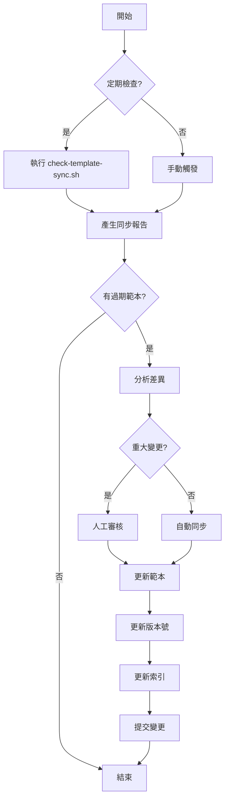

# 範本同步工作流程

## 📋 快速開始

**注意**：以下工具需要手動執行，系統不會自動運行它們。請參考[設定自動執行](#設定自動執行)章節。

### 1. 檢查同步狀態
```bash
# 產生同步狀態報告
.ai/scripts/check-template-sync.sh

# 查看詳細檢查結果
.ai/scripts/check-template-sync.sh detailed
```

### 2. 更新範本版本
```bash
# 更新單一範本
.ai/scripts/update-template-version.sh update usecase/CreateTaskUseCase.java minor "Add validation"

# 批次更新
.ai/scripts/update-template-version.sh batch "projection/.*" patch "Update queries"
```

### 3. 查看範本索引
- [範本索引](examples/TEMPLATE-INDEX.md)
- [版本控制檔案](examples/.versions.json)

## 🔄 同步流程圖



## 📝 操作指南

### 場景 1: 新增範本

1. **識別新模式**
   ```bash
   # 在專案中發現新的設計模式
   grep -r "implements NewPattern" src/
   ```

2. **建立範本檔案**
   ```bash
   # 複製並簡化為範本
   cp src/main/java/.../NewPattern.java \
      .ai/tech-stacks/java-ca-ezddd-spring/examples/patterns/NewPattern.java
   ```

3. **添加版本資訊**
   ```java
   /**
    * Template Version: 1.0.0
    * Based On: src/main/java/.../NewPattern.java
    * Last Sync: 2025-08-05
    * Pattern Category: patterns
    */
   ```

4. **更新版本控制**
   ```bash
   # 手動編輯 .versions.json 或使用工具
   .ai/scripts/update-template-version.sh update patterns/NewPattern.java major "Initial version"
   ```

5. **更新索引**
   - 編輯 `TEMPLATE-INDEX.md`
   - 添加新範本資訊

### 場景 2: 更新現有範本

1. **檢查同步狀態**
   ```bash
   .ai/scripts/check-template-sync.sh detailed | grep "需要更新"
   ```

2. **比較差異**
   ```bash
   diff -u .ai/.../Template.java src/.../Source.java
   ```

3. **評估變更類型**
   - 結構變更 → minor 版本
   - 新增功能 → patch 版本
   - 破壞性變更 → major 版本

4. **更新範本**
   ```bash
   # 編輯範本檔案
   vim .ai/.../Template.java
   
   # 更新版本
   .ai/scripts/update-template-version.sh update Template.java minor "Update structure"
   ```

### 場景 3: 批次同步

1. **識別需同步的類別**
   ```bash
   # 檢查特定類別的同步狀態
   .ai/scripts/check-template-sync.sh report | grep "projection"
   ```

2. **批次更新**
   ```bash
   # 更新所有 projection 範本
   .ai/scripts/update-template-version.sh batch "projection/.*" patch "Sync with latest"
   ```

3. **驗證更新**
   ```bash
   # 列出更新後的版本
   .ai/scripts/update-template-version.sh list "projection/"
   ```

## 🔍 同步檢查清單

### 日常檢查（自動）
- [ ] 編譯錯誤檢測
- [ ] Import 路徑驗證
- [ ] 基本語法檢查
- [ ] 命名規範檢查

### 週期性檢查
- [ ] **每週**
  - [ ] Advanced 類別同步狀態
  - [ ] 新增檔案識別
  - [ ] 棄用範本標記
  
- [ ] **每月**
  - [ ] Patterns 類別完整同步
  - [ ] 版本號更新
  - [ ] 文檔一致性檢查
  - [ ] 產生月度報告
  
- [ ] **每季**
  - [ ] Core 類別審核
  - [ ] 架構調整評估
  - [ ] 範本重組需求
  - [ ] 年度規劃調整

## 📊 報告範例

### 同步狀態報告
```
======================================
範本同步狀態檢查報告
時間: 2025-08-05 12:00:00
======================================

摘要統計
======================================
總範本數: 45
已同步: 40 (89%)
需更新: 5 (11%)

需要更新的範本：
  - usecase/CreateTaskUseCase.java
  - projection/TasksByDateProjection.java
  - mapper/PlanMapper.java
  - controller/CreateTaskController.java
  - test/CreateTaskUseCaseTest.java
```

### 版本清單報告
```
範本版本清單
======================================
範本                                版本      最後同步     狀態
======================================
aggregate/Plan.java                 1.0.0     2025-08-05   synced
aggregate/PlanEvents.java           1.1.0     2025-08-05   synced
usecase/CreateTaskUseCase.java      1.0.0     2025-07-15   outdated
projection/PlanDtosProjection.java  1.0.0     2025-08-05   synced
```

## 🛠️ 故障排除

### 問題 1: 版本檔案損壞
```bash
# 備份現有檔案
cp .versions.json .versions.json.backup

# 重新產生版本檔案
# (需要手動或使用腳本重建)
```

### 問題 2: 同步腳本執行失敗
```bash
# 檢查權限
ls -la .ai/scripts/

# 重新設定執行權限
chmod +x .ai/scripts/*.sh

# 檢查 jq 是否安裝
which jq || brew install jq
```

### 問題 3: 範本編譯錯誤
```bash
# 單獨編譯測試
javac -cp .:lib/* .ai/.../Template.java

# 檢查 import 路徑
grep "^import" .ai/.../Template.java
```

## 🔧 設定自動執行

目前工具需要手動執行或設定排程。以下是自動化選項：

### 1. Cron Job (Linux/macOS)
```bash
# 編輯 crontab
crontab -e

# 每日早上 9 點執行
0 9 * * * cd /path/to/project && .ai/scripts/check-template-sync.sh report

# 每週一執行詳細檢查
0 10 * * 1 cd /path/to/project && .ai/scripts/check-template-sync.sh detailed

# 每月第一天執行版本更新檢查
0 0 1 * * cd /path/to/project && .ai/scripts/update-template-version.sh list
```

### 2. GitHub Actions
建立 `.github/workflows/template-sync-check.yml`：
```yaml
name: Template Sync Check
on:
  schedule:
    - cron: '0 1 * * *'  # 每日 UTC 01:00
  push:
    paths:
      - 'src/**/*.java'
      - '.ai/tech-stacks/**/*.java'

jobs:
  sync-check:
    runs-on: ubuntu-latest
    steps:
      - uses: actions/checkout@v3
      - name: Run Sync Check
        run: |
          chmod +x .ai/scripts/check-template-sync.sh
          .ai/scripts/check-template-sync.sh report
```

### 3. 根據 sync-config.yaml 頻率設定
- **core**: 季度 (0 0 1 */3 *)
- **patterns**: 月度 (0 0 1 * *)
- **advanced**: 雙週 (0 0 */14 * *)

## 📌 最佳實踐

1. **定期執行同步檢查**
   - 使用上述方法設定自動執行
   - 在 PR 前檢查範本同步狀態

2. **保持範本簡潔**
   - 移除專案特定的業務邏輯
   - 使用通用的命名和範例

3. **版本管理**
   - 遵循語義化版本規範
   - 記錄所有重要變更

4. **文檔同步**
   - 範本變更時同步更新 README
   - 保持索引檔案最新

5. **團隊協作**
   - 分享同步報告
   - 討論重大架構變更
   - 維護範本品質

## 🔗 相關資源

- [範本同步規範](./TEMPLATE-SYNC-GUIDE.md)
- [範本索引](examples/TEMPLATE-INDEX.md)
- [版本控制檔案](examples/.versions.json)
- [同步配置](../../config/sync-config.yaml)