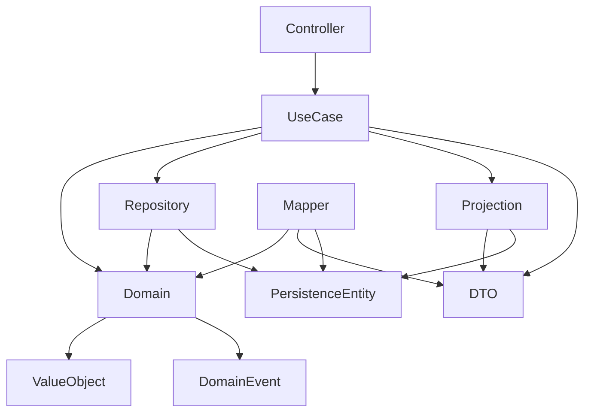

# 範本使用指南 (Template Usage Guide)

本指南說明各種範本的使用時機、選擇標準和最佳實踐。

## 📋 目錄

1. [範本選擇決策樹](#範本選擇決策樹)
2. [按任務類型選擇範本](#按任務類型選擇範本)
3. [範本組合使用指南](#範本組合使用指南)
4. [常見場景範例](#常見場景範例)
5. [範本依賴關係](#範本依賴關係)

## 🌳 範本選擇決策樹

```
開始
├── 建立新功能？
│   ├── 是 → 需要持久化？
│   │   ├── 是 → 建立 Aggregate + Repository + Persistence
│   │   └── 否 → 只建立 Aggregate
│   └── 否 → 查看現有功能
│
├── 實作業務操作？
│   ├── 修改狀態 → UseCase (Command) + Service
│   └── 查詢資料 → UseCase (Query) + Projection
│
├── API 開發？
│   ├── REST API → Controller + DTO
│   └── 內部呼叫 → 直接使用 UseCase
│
└── 資料轉換？
    ├── Domain ↔ DTO → Mapper
    └── Domain ↔ Persistence → Mapper
```

## 📊 按任務類型選擇範本

### 1. 創建新的業務實體

**需要的範本組合**：
```
Aggregate (實體定義)
├── Plan.java
├── PlanId.java (識別碼)
├── PlanEvents.java (事件定義)
└── ProjectName.java (值物件)

Persistence (持久化)
├── PlanData.java
└── PlanMapper.java

Repository (儲存)
└── PlanRepository.java
```

**使用時機**：
- 新的業務概念需要獨立管理
- 有自己的生命週期（創建、修改、刪除）
- 需要保證交易一致性

### 2. 實作創建操作 (Create)

**需要的範本組合**：
```
UseCase
├── CreatePlanUseCase.java (介面)
├── CreatePlanInput.java (輸入)
└── CreatePlanService.java (實作)

Test
└── CreatePlanUseCaseTest.java

Controller (如需 API)
└── CreatePlanController.java
```

**使用時機**：
- 創建新的聚合根
- 在聚合內創建子實體
- 需要發布領域事件

### 3. 實作查詢操作 (Query)

**需要的範本組合**：
```
UseCase
├── GetPlanUseCase.java (介面)
├── GetPlanInput.java (輸入)
└── GetPlanService.java (實作)

Projection (複雜查詢)
├── PlanDtosProjection.java (介面)
└── JpaPlanDtosProjection.java (實作)

DTO
└── PlanDto.java (輸出格式)
```

**使用時機**：
- 單一實體查詢
- 列表查詢
- 條件篩選查詢
- 跨表聯合查詢

### 4. 實作更新操作 (Update)

**需要的範本組合**：
```
UseCase
├── RenameTaskUseCase.java
├── RenameTaskInput.java
└── RenameTaskService.java

Domain Method
└── Plan::renameTask() (領域方法)
```

**使用時機**：
- 修改實體屬性
- 狀態轉換
- 業務規則驗證

### 5. 實作刪除操作 (Delete)

**需要的範本組合**：
```
UseCase
├── DeleteTaskUseCase.java
├── DeleteTaskInput.java
└── DeleteTaskService.java

Domain Method
└── Plan::deleteTask() (領域方法)
```

**使用時機**：
- 邏輯刪除（標記為已刪除）
- 物理刪除（完全移除）
- 級聯刪除處理

## 🔗 範本組合使用指南

### 場景一：完整的 CRUD 功能

```yaml
需要範本：
  Domain Layer:
    - Aggregate: Plan.java
    - Value Objects: PlanId.java, ProjectName.java
    - Events: PlanEvents.java
    
  Application Layer:
    - Commands: Create/Update/Delete UseCase + Service
    - Queries: Get/List UseCase + Service
    - DTOs: PlanDto.java, ProjectDto.java
    - Mappers: PlanMapper.java
    
  Infrastructure Layer:
    - Persistence: PlanData.java
    - Repository: JpaPlanRepository.java
    - Projections: JpaPlanDtosProjection.java
    
  Interface Layer:
    - Controllers: PlanController.java
    - Request/Response DTOs
```

### 場景二：跨聚合操作

```yaml
需要範本：
  - UseCase: AssignTagUseCase.java
  - Service: AssignTagService.java (協調多個 Repository)
  - Reactor: NotifyTaskToAssignTagReactor.java (處理副作用)
  - Domain Events: TagAssigned, TagUnassigned
```

### 場景三：複雜查詢

```yaml
需要範本：
  - Projection Interface: TasksByDateProjection.java
  - JPA Implementation: JpaTasksByDateProjection.java
  - DTO: TaskDto.java (包含所需欄位)
  - Mapper: TaskMapper.java (轉換邏輯)
```

## 💡 常見場景範例

### 1. 用戶故事：作為用戶，我想創建一個新計畫

**選擇範本**：
1. 先看是否已有 Plan Aggregate → 有
2. 選擇 CreatePlanUseCase 範本
3. 選擇 CreatePlanService 範本
4. 如需 API，選擇 Controller 範本

### 2. 用戶故事：作為用戶，我想查看今日到期的任務

**選擇範本**：
1. 這是查詢操作 → 選擇 Query UseCase
2. 需要條件篩選 → 選擇 Projection 範本
3. 選擇 TasksDueTodayProjection 範本
4. 選擇 JpaTasksDueTodayProjection 實作

### 3. 用戶故事：作為用戶，我想為任務添加標籤

**選擇範本**：
1. 這是跨聚合操作 → 選擇 AssignTagUseCase
2. 需要更新 Task → 使用領域方法
3. 需要驗證 Tag 存在 → 查詢 TagRepository

## 📐 範本依賴關係



## ✅ 範本選擇檢查清單

在選擇範本前，請確認：

- [ ] 明確了解任務類型（Command vs Query）
- [ ] 確定涉及的聚合根
- [ ] 識別需要的輸入和輸出
- [ ] 考慮是否需要跨聚合協調
- [ ] 評估是否需要特殊查詢（Projection）
- [ ] 決定是否需要 API 端點
- [ ] 確認是否需要事件處理

## 🚀 快速開始

### 最常用的範本組合

1. **新增功能**：
   ```
   CreateXxxUseCase + CreateXxxService + XxxDto
   ```

2. **查詢功能**：
   ```
   GetXxxUseCase + GetXxxService + XxxProjection + XxxDto
   ```

3. **更新功能**：
   ```
   UpdateXxxUseCase + UpdateXxxService + Domain Method
   ```

4. **API 端點**：
   ```
   XxxController + Request/Response DTO + UseCase
   ```

## 📝 使用建議

1. **先定義領域模型**：從 Aggregate 和 Value Object 開始
2. **再實作用例**：根據業務需求選擇 Command 或 Query
3. **最後加入介面**：Controller 和 DTO 是最外層
4. **逐步完善**：先實作核心功能，再加入 Projection 等優化

## 🔍 相關資源

- [範本索引](examples/TEMPLATE-INDEX.md)
- [程式碼標準](CODING-STANDARDS.md)
- [範本同步指南](TEMPLATE-SYNC-GUIDE.md)
- [設計模式說明](coding-guide.md)