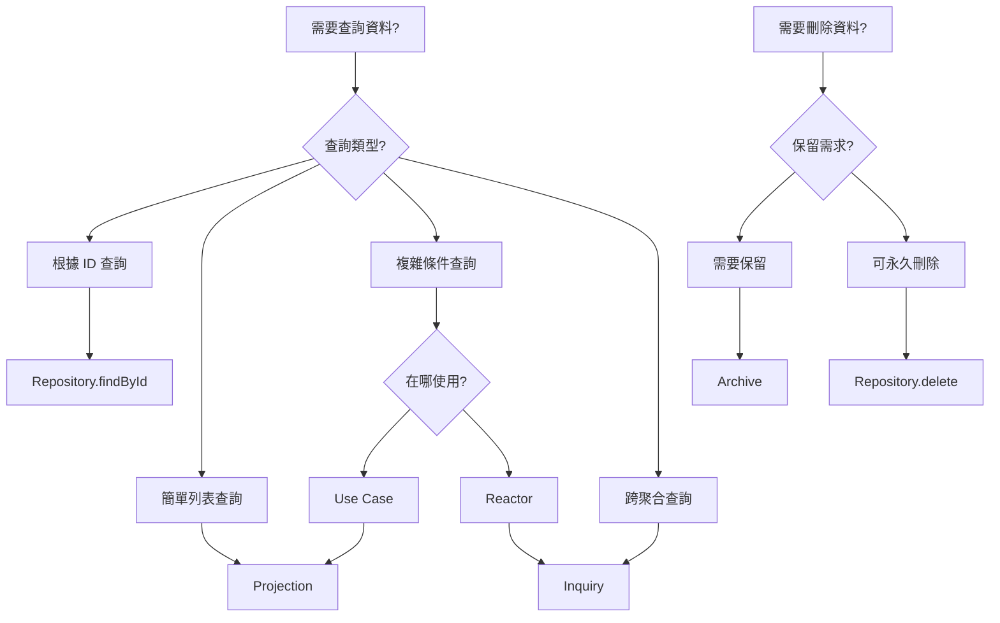

# Inquiry 與 Archive 設計模式

## 📚 概述

在 ezddd 框架的 CQRS 架構中，除了標準的 Repository 和 Projection 模式外，還提供了兩個重要的資料存取模式：**Inquiry** 和 **Archive**。

## 🔍 Inquiry 模式

### 定義
Inquiry 是一種**特定查詢介面**，用於處理複雜或特定的查詢需求，特別是那些無法通過標準 Repository 方法（findById, save, delete）滿足的查詢。

### 何時使用 Inquiry

✅ **使用 Inquiry 當：**
- 需要跨聚合的複雜查詢
- Reactor 中需要查詢其他聚合的相關資料
- 需要特定的搜尋條件（如：找出某個 Sprint 的所有 PBI）
- 查詢邏輯過於複雜，不適合放在 Projection

❌ **不要使用 Inquiry 當：**
- 簡單的 ID 查詢（使用 Repository.findById）
- 標準的列表查詢（使用 Projection）
- 可以通過聚合根導航獲得的資料

### Inquiry 介面設計原則

1. **單一職責**：每個 Inquiry 介面只負責一種特定查詢
2. **明確命名**：使用 `Find[What]By[Condition]Inquiry` 格式
3. **返回簡單類型**：優先返回 ID 列表或簡單 DTO
4. **無副作用**：Inquiry 只讀取，不修改資料

### 實作範例

#### 介面定義
```java
package tw.teddysoft.aiscrum.sprint.usecase.port.out.inquiry;

import tw.teddysoft.aiscrum.sprint.entity.SprintId;
import java.util.List;

/**
 * 查詢特定 Sprint 下的所有 ProductBacklogItem ID
 */
public interface FindPbisBySprintIdInquiry {
    
    /**
     * 根據 Sprint ID 查詢所有相關的 PBI ID
     * 
     * @param sprintId Sprint 的唯一識別碼
     * @return PBI ID 列表，如果沒有找到則返回空列表
     */
    List<String> findBySprintId(SprintId sprintId);
}
```

#### JPA 實作
```java
package tw.teddysoft.aiscrum.sprint.adapter.out.persistence.inquiry;

import org.springframework.data.jpa.repository.Query;
import org.springframework.data.repository.CrudRepository;
import org.springframework.data.repository.query.Param;
import tw.teddysoft.aiscrum.sprint.entity.SprintId;
import tw.teddysoft.aiscrum.sprint.usecase.port.out.inquiry.FindPbisBySprintIdInquiry;
import tw.teddysoft.aiscrum.sprint.usecase.port.out.ProductBacklogItemData;

import java.util.List;

/**
 * JPA implementation using Spring Data JPA interface.
 * This interface extends both the business interface and CrudRepository.
 */
public interface JpaFindPbisBySprintIdInquiry 
        extends FindPbisBySprintIdInquiry, 
                CrudRepository<ProductBacklogItemData, String> {
    
    @Override
    default List<String> findBySprintId(SprintId sprintId) {
        return getPbisBySprintId(sprintId.value());
    }
    
    @Query(value = """
            SELECT p.pbi_id 
            FROM product_backlog_item_data p 
            WHERE p.sprint_id = :sprintId 
            ORDER BY p.order_id ASC, p.importance DESC
            """, nativeQuery = true)
    List<String> getPbisBySprintId(@Param("sprintId") String sprintId);
}
```

### 在 Reactor 中使用 Inquiry

#### Reactor Interface 定義
```java
import tw.teddysoft.ezddd.entity.DomainEvent;
import tw.teddysoft.ezddd.usecase.port.in.interactor.Reactor;

// ✅ 正確：繼承 Reactor<DomainEvent>
public interface NotifyPbiWhenSprintStartedReactor extends Reactor<DomainEvent> {
}
```

#### Reactor Service 實作
```java
public class NotifyPbiWhenSprintStartedService implements NotifyPbiWhenSprintStartedReactor {
    
    private final FindPbisBySprintIdInquiry findPbisBySprintIdInquiry;
    private final StartPbiUseCase startPbiUseCase;
    
    public NotifyPbiWhenSprintStartedService(
            FindPbisBySprintIdInquiry findPbisBySprintIdInquiry,
            StartPbiUseCase startPbiUseCase) {
        requireNotNull("FindPbisBySprintIdInquiry", findPbisBySprintIdInquiry);
        requireNotNull("StartPbiUseCase", startPbiUseCase);
        this.findPbisBySprintIdInquiry = findPbisBySprintIdInquiry;
        this.startPbiUseCase = startPbiUseCase;
    }
    
    @Override
    public void execute(Object event) {
        requireNotNull("Event", event);
        
        if (event instanceof SprintEvents.SprintStarted sprintStarted) {
            // 使用 Inquiry 查詢相關的 PBI
            List<String> pbiIds = findPbisBySprintIdInquiry.findBySprintId(
                SprintId.valueOf(sprintStarted.sprintId())
            );
            
            // 對每個 PBI 執行狀態更新
            for (String pbiId : pbiIds) {
                StartPbiInput input = new StartPbiInput();
                input.setPbiId(pbiId);
                input.setSprintId(sprintStarted.sprintId());
                input.setStartedBy(sprintStarted.startedBy());
                
                try {
                    startPbiUseCase.execute(input);
                } catch (Exception e) {
                    // Log error but don't stop processing other PBIs
                    logger.error("Failed to start PBI: " + pbiId, e);
                }
            }
        }
    }
}
```

## 🗄️ Archive 模式

### 定義
Archive 是一種**軟刪除和歷史記錄**模式，用於保留已刪除或過時的資料，同時將其從主要查詢中排除。

### 何時使用 Archive

✅ **使用 Archive 當：**
- 需要保留刪除記錄以供審計
- 需要實作軟刪除功能
- 需要保存歷史版本
- 法規要求保留資料一定期限

❌ **不要使用 Archive 當：**
- 資料可以永久刪除
- 使用 Event Sourcing（事件本身就是歷史）
- 簡單的狀態變更（使用狀態欄位即可）

### Archive 介面設計原則

1. **保留完整資料**：歸檔時保存完整的聚合狀態
2. **記錄元資料**：包含歸檔時間、原因、操作者
3. **支援查詢**：提供查詢歸檔資料的方法
4. **可恢復性**：設計恢復機制（如果需要）

### 實作範例

#### Archive 介面
```java
package tw.teddysoft.aiscrum.product.usecase.port.out.archive;

import tw.teddysoft.aiscrum.product.entity.Product;
import tw.teddysoft.aiscrum.product.entity.ProductId;
import java.time.LocalDateTime;
import java.util.Optional;
import java.util.List;

/**
 * Product 歸檔介面，用於軟刪除和歷史記錄
 */
public interface ProductArchive {
    
    /**
     * 歸檔一個產品
     * 
     * @param product 要歸檔的產品
     * @param reason 歸檔原因
     * @param archivedBy 執行歸檔的使用者
     */
    void archive(Product product, String reason, String archivedBy);
    
    /**
     * 根據 ID 查詢歸檔的產品
     * 
     * @param productId 產品 ID
     * @return 歸檔的產品（如果存在）
     */
    Optional<ArchivedProduct> findArchivedById(ProductId productId);
    
    /**
     * 查詢某個時間範圍內歸檔的產品
     * 
     * @param from 開始時間
     * @param to 結束時間
     * @return 歸檔產品列表
     */
    List<ArchivedProduct> findArchivedBetween(LocalDateTime from, LocalDateTime to);
    
    /**
     * 恢復歸檔的產品
     * 
     * @param productId 產品 ID
     * @param restoredBy 執行恢復的使用者
     * @return 恢復的產品
     */
    Optional<Product> restore(ProductId productId, String restoredBy);
}
```

#### ArchivedProduct DTO
```java
package tw.teddysoft.aiscrum.product.usecase.port.out.archive;

import java.time.LocalDateTime;

public record ArchivedProduct(
    String productId,
    String name,
    String goal,
    LocalDateTime archivedAt,
    String archivedBy,
    String reason,
    String originalData  // JSON 格式的完整資料
) {
    public static ArchivedProduct from(Product product, String reason, String archivedBy) {
        return new ArchivedProduct(
            product.getId().id(),
            product.getName(),
            product.getGoal(),
            LocalDateTime.now(),
            archivedBy,
            reason,
            JsonSerializer.toJson(product)  // 序列化完整資料
        );
    }
}
```

#### JPA 實作
```java
package tw.teddysoft.aiscrum.product.adapter.out.persistence.archive;

import org.springframework.stereotype.Repository;
import org.springframework.transaction.annotation.Transactional;
import tw.teddysoft.aiscrum.product.entity.Product;
import tw.teddysoft.aiscrum.product.entity.ProductId;
import tw.teddysoft.aiscrum.product.usecase.port.out.archive.ProductArchive;
import tw.teddysoft.aiscrum.product.usecase.port.out.archive.ArchivedProduct;

import jakarta.persistence.EntityManager;
import jakarta.persistence.PersistenceContext;
import java.time.LocalDateTime;
import java.util.List;
import java.util.Optional;

@Repository
public class JpaProductArchive implements ProductArchive {
    
    @PersistenceContext
    private EntityManager entityManager;
    
    @Override
    @Transactional
    public void archive(Product product, String reason, String archivedBy) {
        // 1. 創建歸檔記錄
        ArchivedProductData archived = new ArchivedProductData();
        archived.setProductId(product.getId().id());
        archived.setName(product.getName());
        archived.setGoal(product.getGoal());
        archived.setArchivedAt(LocalDateTime.now());
        archived.setArchivedBy(archivedBy);
        archived.setReason(reason);
        archived.setOriginalData(JsonSerializer.toJson(product));
        
        // 2. 保存歸檔記錄
        entityManager.persist(archived);
        
        // 3. 從主表中標記為已刪除（軟刪除）
        ProductData productData = entityManager.find(ProductData.class, product.getId().id());
        if (productData != null) {
            productData.setDeleted(true);
            productData.setDeletedAt(LocalDateTime.now());
            entityManager.merge(productData);
        }
    }
    
    @Override
    public Optional<ArchivedProduct> findArchivedById(ProductId productId) {
        String jpql = "SELECT a FROM ArchivedProductData a WHERE a.productId = :productId";
        
        List<ArchivedProductData> results = entityManager
            .createQuery(jpql, ArchivedProductData.class)
            .setParameter("productId", productId.id())
            .getResultList();
        
        return results.isEmpty() ? Optional.empty() : 
            Optional.of(toArchivedProduct(results.get(0)));
    }
    
    @Override
    public List<ArchivedProduct> findArchivedBetween(LocalDateTime from, LocalDateTime to) {
        String jpql = "SELECT a FROM ArchivedProductData a " +
                     "WHERE a.archivedAt BETWEEN :from AND :to " +
                     "ORDER BY a.archivedAt DESC";
        
        return entityManager
            .createQuery(jpql, ArchivedProductData.class)
            .setParameter("from", from)
            .setParameter("to", to)
            .getResultList()
            .stream()
            .map(this::toArchivedProduct)
            .toList();
    }
    
    @Override
    @Transactional
    public Optional<Product> restore(ProductId productId, String restoredBy) {
        // 1. 找到歸檔記錄
        Optional<ArchivedProduct> archived = findArchivedById(productId);
        if (archived.isEmpty()) {
            return Optional.empty();
        }
        
        // 2. 反序列化原始資料
        Product product = JsonSerializer.fromJson(
            archived.get().originalData(), 
            Product.class
        );
        
        // 3. 恢復主表記錄
        ProductData productData = entityManager.find(ProductData.class, productId.id());
        if (productData != null) {
            productData.setDeleted(false);
            productData.setDeletedAt(null);
            entityManager.merge(productData);
        }
        
        // 4. 記錄恢復操作（可選）
        // logRestoration(productId, restoredBy);
        
        return Optional.of(product);
    }
    
    private ArchivedProduct toArchivedProduct(ArchivedProductData data) {
        return new ArchivedProduct(
            data.getProductId(),
            data.getName(),
            data.getGoal(),
            data.getArchivedAt(),
            data.getArchivedBy(),
            data.getReason(),
            data.getOriginalData()
        );
    }
}
```

### 在 Use Case 中使用 Archive

```java
public class DeleteProductService implements DeleteProductUseCase {
    
    private final Repository<Product, ProductId> productRepository;
    private final ProductArchive productArchive;
    
    public DeleteProductService(
            Repository<Product, ProductId> productRepository,
            ProductArchive productArchive) {
        this.productRepository = productRepository;
        this.productArchive = productArchive;
    }
    
    @Override
    public DeleteProductOutput execute(DeleteProductInput input) {
        requireNotNull("Input", input);
        
        // 1. 找到產品
        Product product = productRepository.findById(ProductId.valueOf(input.getProductId()))
            .orElseThrow(() -> new IllegalArgumentException("Product not found"));
        
        // 2. 歸檔而非刪除
        productArchive.archive(
            product,
            input.getReason() != null ? input.getReason() : "User requested deletion",
            input.getDeletedBy()
        );
        
        // 3. 發布事件
        product.markAsDeleted(input.getDeletedBy());
        
        return DeleteProductOutput.create()
            .setProductId(input.getProductId())
            .setMessage("Product archived successfully");
    }
}
```

## 🔄 Inquiry vs Projection vs Archive

| 特性 | Repository | Projection | Inquiry | Archive |
|-----|-----------|------------|---------|---------|
| **用途** | 基本 CRUD | 唯讀視圖查詢 | 特定複雜查詢 | 軟刪除與歷史 |
| **方法數量** | 固定 3 個 | 通常 1-2 個 | 通常 1 個 | 3-5 個 |
| **返回類型** | 聚合根 | DTO | ID 列表或簡單 DTO | 歸檔 DTO |
| **使用場景** | 聚合操作 | CQRS 查詢端 | Reactor、特殊查詢 | 審計、合規 |
| **副作用** | 有（save） | 無 | 無 | 有（歸檔/恢復） |

## 📋 最佳實踐

### Inquiry 最佳實踐
1. **保持簡單**：每個 Inquiry 只做一件事
2. **明確命名**：從名稱就能看出查詢的內容和條件
3. **返回必要資料**：只返回需要的欄位，避免過度查詢
4. **考慮效能**：為常用查詢建立適當的索引
5. **文件化**：清楚說明查詢的目的和使用場景

### Archive 最佳實踐
1. **完整保存**：歸檔時保存完整的聚合狀態
2. **記錄元資料**：誰、何時、為何進行歸檔
3. **定期清理**：根據法規要求定期清理過期的歸檔資料
4. **存取控制**：歸檔資料的查詢和恢復需要適當權限
5. **審計追蹤**：記錄所有歸檔和恢復操作

## 🎯 選擇指南



## 📚 參考資料

- [ezddd CQRS Documentation](https://gitlab.com/TeddyChen/ezddd)
- [Domain-Driven Design by Eric Evans](https://www.domainlanguage.com/ddd/)
- [Implementing Domain-Driven Design by Vaughn Vernon](https://www.informit.com/store/implementing-domain-driven-design-9780321834577)