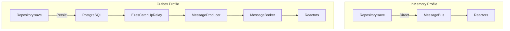

# Event Architecture Reference - Profile-Based Event Propagation

## 🎯 Overview
This document shows how AiScrumApp orchestrates different event propagation mechanisms based on the active Spring Profile.

## 📊 Architecture Comparison



## 📝 AiScrumApp.java - Complete Reference

```java
package tw.teddysoft.aiscrum.io.springboot;

import org.springframework.beans.factory.annotation.Autowired;
import org.springframework.boot.SpringApplication;
import org.springframework.boot.autoconfigure.SpringBootApplication;
import jakarta.annotation.PostConstruct;
import jakarta.annotation.PreDestroy;
import tw.teddysoft.aiscrum.common.MyInMemoryMessageBroker;
import tw.teddysoft.ezddd.data.io.ezes.relay.EzesCatchUpRelay;
import tw.teddysoft.ezddd.data.io.ezes.relay.MessageDbToDomainEventDataConverter;
import tw.teddysoft.ezddd.data.io.ezes.store.MessageData;
import tw.teddysoft.ezddd.data.io.ezes.store.PgMessageDbClient;
import tw.teddysoft.ezddd.entity.DomainEvent;
import tw.teddysoft.ezddd.usecase.port.inout.domainevent.DomainEventData;
import tw.teddysoft.ezddd.usecase.port.inout.messaging.MessageBus;
import tw.teddysoft.ezddd.usecase.port.inout.messaging.MessageProducer;

import java.nio.file.Path;
import java.util.concurrent.ExecutorService;
import java.util.concurrent.Executors;

@SpringBootApplication(scanBasePackages = "tw.teddysoft.aiscrum")
public class AiScrumApp {

    private static final String RDB_SCRUM_CHECKPOINT_PATH = "./scrum_checkpoint.txt";
    private final ExecutorService executor;
    
    // InMemory Profile dependencies (optional injection)
    private final MessageBus<DomainEvent> messageBus;
    
    // Outbox Profile dependencies (optional injection)
    private final PgMessageDbClient pgMessageDbClient;
    private final MessageProducer<DomainEventData> messageProducer;
    private final MyInMemoryMessageBroker messageBroker;
    
    @Autowired
    public AiScrumApp(
            @Autowired(required = false) MessageBus<DomainEvent> messageBus,
            @Autowired(required = false) PgMessageDbClient pgMessageDbClient,
            @Autowired(required = false) MessageProducer<DomainEventData> messageProducer,
            @Autowired(required = false) MyInMemoryMessageBroker messageBroker) {
        
        this.executor = Executors.newVirtualThreadPerTaskExecutor();
        this.messageBus = messageBus;
        this.pgMessageDbClient = pgMessageDbClient;
        this.messageProducer = messageProducer;
        this.messageBroker = messageBroker;
    }
    
    @PostConstruct
    public void init() {
        // Initialize domain event type mappers
        BootstrapConfig.initialize();
        
        // Profile-based initialization
        if (isOutboxProfile()) {
            initializeOutboxMode();
        } else {
            initializeInMemoryMode();
        }
    }
    
    private boolean isOutboxProfile() {
        return messageBroker != null && pgMessageDbClient != null && messageProducer != null;
    }
    
    private void initializeOutboxMode() {
        System.out.println("===> Initializing OUTBOX mode");
        System.out.println("===> Event flow: Repository → PostgreSQL → Relay → MessageBroker → Reactors");
        
        // Start MessageBroker thread for async processing
        executor.execute(messageBroker);
        
        // Start EzesCatchUpRelay to read events from database
        executor.execute(createEzesCatchUpEventRelay(
            pgMessageDbClient,
            messageProducer,
            RDB_SCRUM_CHECKPOINT_PATH
        ));
    }
    
    private void initializeInMemoryMode() {
        System.out.println("===> Initializing INMEMORY mode");
        System.out.println("===> Event flow: Repository → MessageBus → Reactors");
        
        // MessageBus is already configured and injected
        // Reactors are registered to MessageBus automatically
    }
    
    private EzesCatchUpRelay<DomainEventData> createEzesCatchUpEventRelay(
            PgMessageDbClient messageDbClient,
            MessageProducer<DomainEventData> producer,
            String checkpointPath) {
        
        var converter = new MessageDbToDomainEventDataConverter();
        var configuration = EzesCatchUpRelay.RelayConfiguration.of(
            messageDbClient,
            producer,
            Path.of(checkpointPath),
            converter
        );
        return new EzesCatchUpRelay<>(configuration);
    }
    
    @PreDestroy
    public void cleanup() {
        executor.shutdown();
    }
    
    public static void main(String[] args) {
        SpringApplication.run(AiScrumApp.class, args);
    }
}
```

## 🔍 How Profile Detection Works

### Pattern Recognition in init()
```java
if (messageBroker != null && pgMessageDbClient != null && messageProducer != null) {
    // All Outbox components present → Outbox mode
} else {
    // Missing Outbox components → InMemory mode
}
```

### Bean Availability by Profile

| Bean | InMemory | Outbox |
|------|----------|--------|
| MessageBus<DomainEvent> | ✅ Injected | ❌ null |
| MyInMemoryMessageBroker | ❌ null | ✅ Injected |
| MessageProducer | ❌ null | ✅ Injected |
| PgMessageDbClient | ❌ null | ✅ Injected |

## 📋 Event Processing Examples

### InMemory Mode Example
```java
// 1. Save aggregate
Product product = new Product(/*...*/);
productRepository.save(product);

// 2. Repository extracts events
List<DomainEvent> events = product.getDomainEvents();

// 3. Repository publishes to MessageBus
messageBus.post(events);

// 4. MessageBus triggers Reactors synchronously
// ProductCreatedReactor.execute() is called immediately
```

### Outbox Mode Example
```java
// 1. Save aggregate
Product product = new Product(/*...*/);
productRepository.save(product);

// 2. OutboxRepository persists to PostgreSQL
// - Product data saved to product table
// - Events saved to message store

// 3. EzesCatchUpRelay (running in background)
// - Reads new events from database
// - Converts to DomainEventData
// - Sends via MessageProducer

// 4. MessageBroker receives events
// - Posts to registered Reactors
// - Processing happens asynchronously
```

## 🚨 Common Pitfalls

### ❌ Wrong: Mixing Beans
```java
@Configuration
public class WrongConfig {
    @Bean
    public MessageBus<DomainEvent> messageBus() { /*...*/ }
    
    @Bean
    public MyInMemoryMessageBroker messageBroker() { /*...*/ }
    // DON'T provide both!
}
```

### ❌ Wrong: Creating PgMessageDbClient directly
```java
@Bean
public PgMessageDbClient pgMessageDbClient(DataSource dataSource) {
    return new PgMessageDbClient(dataSource); // Will fail!
}
```

### ✅ Correct: Profile-specific beans
```java
@Configuration
@Profile({"inmemory", "test-inmemory"})
public class InMemoryConfig {
    @Bean
    public MessageBus<DomainEvent> messageBus() { /*...*/ }
}

@Configuration
@Profile({"outbox", "test-outbox"})
public class OutboxConfig {
    @Bean
    public MyInMemoryMessageBroker messageBroker() { /*...*/ }
}
```

## 📚 Required Reading

1. [InMemory Profile Config](./inmemory-profile-config.md)
2. [Outbox Profile Config](./outbox-profile-config.md)
3. [Framework API Integration Guide](../../../../guides/FRAMEWORK-API-INTEGRATION-GUIDE.md)