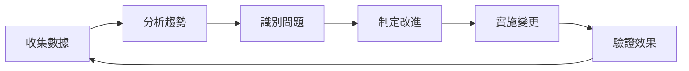

# Quality Tracking Workflow

## 目的
建立專案品質追蹤系統，監控代碼品質、開發效率和協作效果。

## 適用場景
- 需要追蹤專案品質指標
- 評估 AI 協作效果
- 持續改進開發流程
- 生成品質報告

## 工作流程

### 階段 1：定義指標

**指標類型**：
```yaml
代碼品質:
  - 測試覆蓋率
  - 代碼複雜度
  - 技術債務
  - 安全漏洞

開發效率:
  - 任務完成時間
  - 缺陷密度
  - 修復時間
  - 部署頻率

協作效果:
  - AI 建議採納率
  - 人工修正比例
  - 知識重用率
  - 文檔完整度
```

### 階段 2：設置追蹤

**實施方式**：
1. **自動化收集**
   - CI/CD 整合
   - 代碼分析工具
   - 測試報告解析

2. **手動記錄**
   - 任務完成記錄
   - 問題追蹤
   - 改進建議

3. **工具整合**
   ```yaml
   通用工具:
     - Git: 提交統計
     - 測試框架: 覆蓋率報告
     - Linter: 代碼品質
   
   可選工具:
     - SonarQube: 綜合品質分析
     - JIRA: 問題追蹤
     - Grafana: 視覺化儀表板
   ```

### 階段 3：數據收集

**收集模板**：
```json
{
  "timestamp": "ISO-8601",
  "task": {
    "id": "task-id",
    "type": "feature|bugfix|refactor",
    "complexity": "low|medium|high"
  },
  "metrics": {
    "duration": "minutes",
    "iterations": "count",
    "tests_added": "count",
    "coverage_delta": "percentage"
  },
  "quality": {
    "issues_found": "count",
    "issues_fixed": "count",
    "review_comments": "count"
  },
  "ai_collaboration": {
    "suggestions_made": "count",
    "suggestions_accepted": "count",
    "manual_corrections": "count"
  }
}
```

### 階段 4：報告生成

**報告類型**：
1. **即時儀表板**
   - 關鍵指標概覽
   - 趨勢圖表
   - 警報和提醒

2. **週期報告**
   - 週報/月報
   - 趨勢分析
   - 改進建議

3. **專題分析**
   - 深度問題分析
   - 最佳實踐總結
   - 團隊效率評估

### 階段 5：持續改進

**改進循環**：


## 實施範例

### 1. 簡單品質追蹤
```bash
# 創建品質記錄
mkdir -p .quality/reports/$(date +%Y-%m)

# 記錄任務完成
echo "Task: feature-123, Duration: 45min, Tests: 5, Coverage: +3%" >> .quality/log.txt

# 生成月報
./generate-quality-report.sh
```

### 2. 自動化追蹤
```yaml
# GitHub Actions 範例
- name: Collect Metrics
  run: |
    coverage=$(npm test -- --coverage | grep "All files" | awk '{print $10}')
    echo "coverage=$coverage" >> $GITHUB_ENV
    
- name: Update Dashboard
  run: |
    echo "Coverage: ${{ env.coverage }}" >> .quality/dashboard.md
```

### 3. AI 協作效果追蹤
```markdown
## AI 協作記錄
- 任務：實現用戶認證
- AI 建議：15 個
- 採納：12 個 (80%)
- 修正：2 處
- 節省時間：約 2 小時
```

## 成功標準

- [ ] 定義適合專案的關鍵指標
- [ ] 建立數據收集機制
- [ ] 生成可視化報告
- [ ] 基於數據做出改進
- [ ] 品質指標持續提升

## 輕量級實施

如果不需要複雜的追蹤系統，可以：
1. 使用簡單的 Markdown 記錄
2. 利用 Git 統計
3. 定期手動總結
4. 專注於最重要的 2-3 個指標

## 與其他工作流程整合

- **codebase-improvement**: 使用品質數據指導改進
- **collaborative-documentation**: 記錄品質標準和目標
- **script-automation**: 自動化指標收集

## 注意事項

1. **避免過度追蹤**：專注於有意義的指標
2. **保持簡單**：從簡單開始，逐步完善
3. **行動導向**：數據要能指導具體改進
4. **團隊共識**：確保團隊理解和認同指標